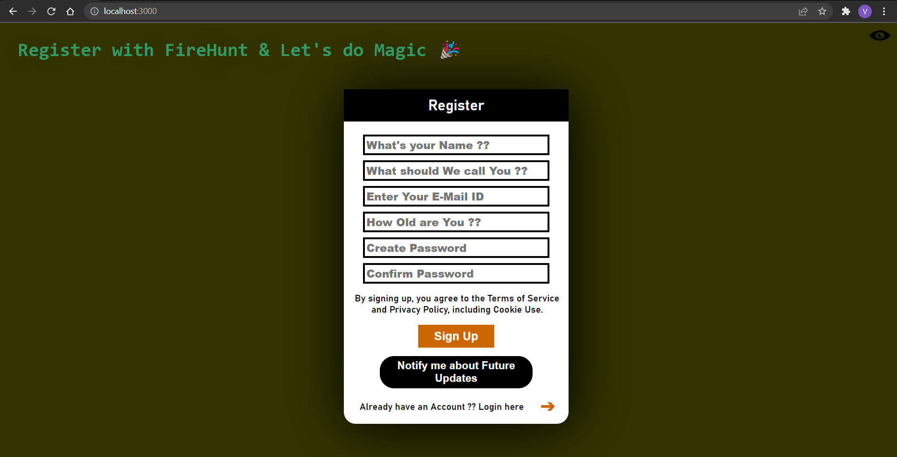
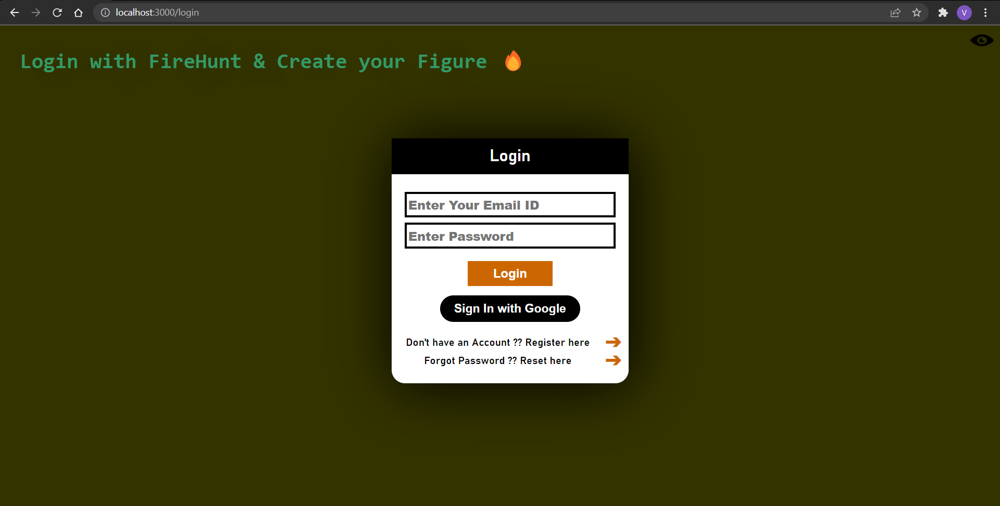
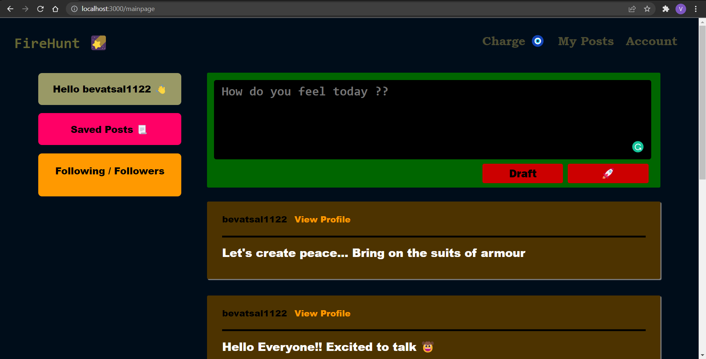
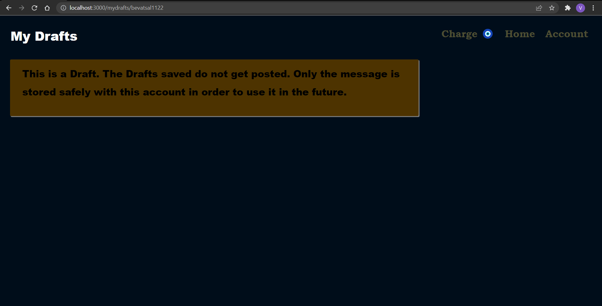
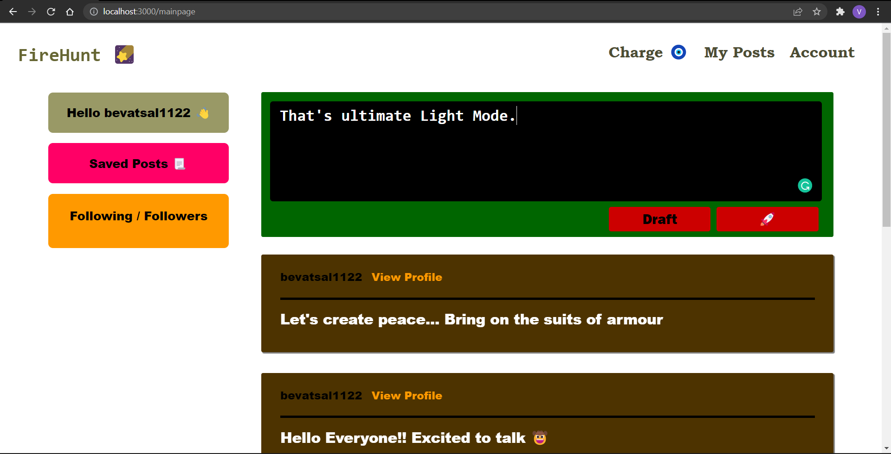
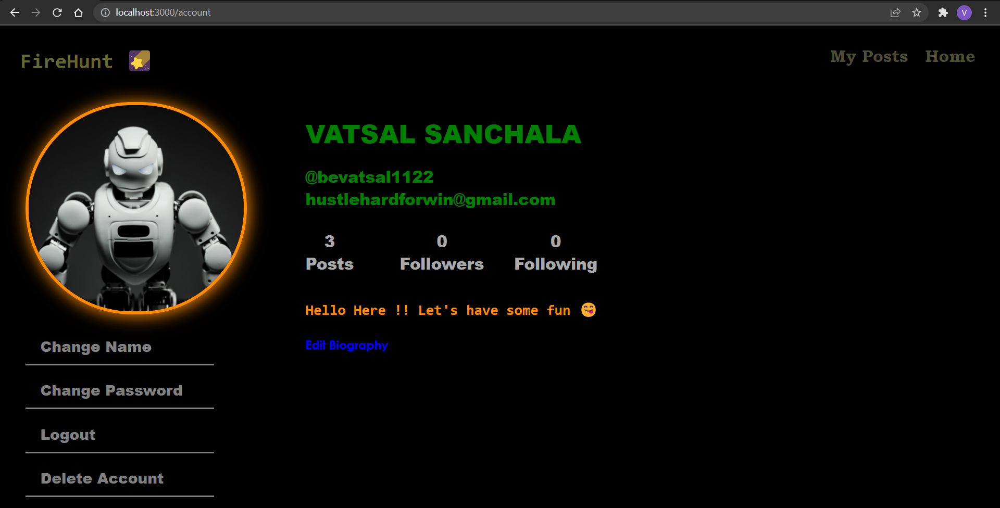
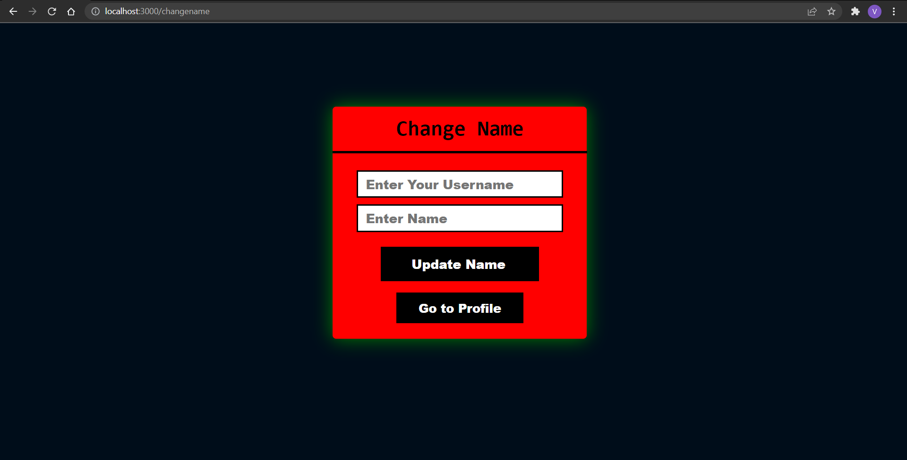
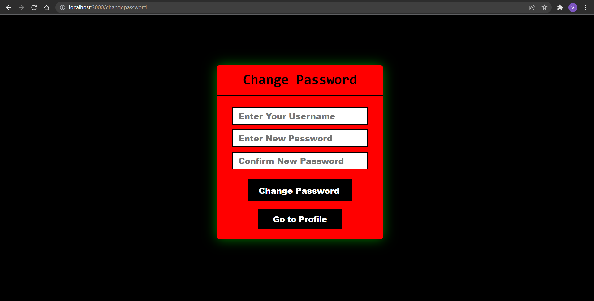
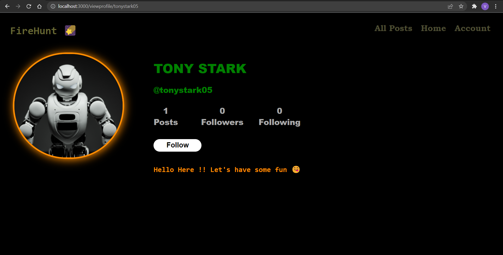
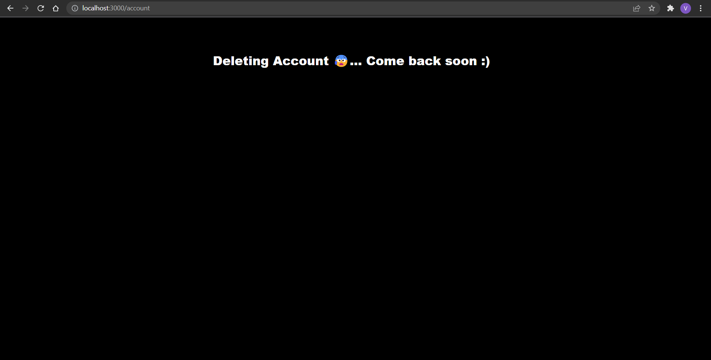

# FireHunt

### Project Details - 

- ### Technologies Used: HTML, CSS, Javascript, ReactJS, MeteorJS, Google Firebase (Firestore), MongoDB
- ### Development Environment: Windows 10, Windows 11, VS Code (IDE), Atom (IDE)

-----

### Project Description - 

### FireHunt (Web Application) is a locally developed Social Media Site which supports Follow & Following Features, Services like Posting and Drafting Messsages, Adding/Removing Self Introduction from Profile and many others. Every Account has a Unique Username & E-Mail ID through which the Profile is identified and processed for operations. The User's Data including Name, Username, E-Mail ID, Self Introduction, Total Posts Count & Other Sections is privately stored in Firebase Firestore Database. Other Information like No. of Followers, Total Following Count, Messages Posted is privately stored in MongoDB Database. Upon Successfully Registering, User receives a Verification E-Mail at the E-Mail ID associated with that Account. Without Confirming the E-Mail ID, User is not allowed to navigate to Account Page. The User can Change Self Introduction, Name, Password & can Sign Out & Delete Account from the Account Page. The UserName can Post & Draft Messages from the Home Page of the App. Also, User can navigate to Other User's Profile Page where they can Follow/Unfollow the User in the Profile. The Live Updating & Refreshing of the Data is truly supported on every page of Web App..

### Please Note: All Data associated with the Account is properly deleted upon Successful Deletion of Account. It is assured that No Data is misued anywhere.

-----

### Project Overview -
 

-----

### Instructions - 

- ### Include your Firebase Configurations in the [_FirebaseConfig_](https://github.com/bevatsal1122/FireHunt/blob/main/imports/ui/FirebaseConfig.js) File in order to execute the App properly as expected. Also, ReactJS, MeteorJS, Google Firebase & MongoDB should be installed to run the App. 
- ### The User's Information is stored in `accounts` Collection with Individual UID's as Document Names in Firebase Firestore.
